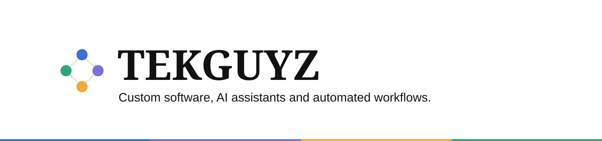

<p align="center"></p>

<p align="center">
  
  
  
  
</p>

**The tekguyz.com site: a small, technical team that builds custom software, AI assistants and automated workflows for operational businesses.**

[Live site](https://tekguyz.com)

## Status

| | |
|---|---|
| Phase | Live. `tekguyz.com` serves this build. |
| Shipped | Full site, AI concierge, lead capture to the CRM, `/work` lineup of 6 (pass 2 of #13). |
| Next | Open items are in [`docs/KNOWN_GAPS.md`](docs/KNOWN_GAPS.md). |
| Updated | 2026-10-01 |

## What it does

- Shows what TEKGUYZ builds: solution lines, a `/work` lineup, process and FAQ.
- Takes leads through one shared contact action, used by the form and the concierge.
- Sends each lead to the CRM as a signed request.
- Runs an AI concierge (Gemini) that answers questions and can start a lead.
- Rate-limits public actions with Upstash or Vercel KV.
- Works in light and dark mode, with reduced-motion support.

## What it never does

- The concierge never states a price and never promises a timeline.
- It never invents metrics, client names or prices in copy.
- No accent color ever fills a button. Primary buttons are ink.
- It never exposes a secret: every env var is server-only.
- It never ships parallax, marquees, particles, glassmorphism or cursor-followers.

## Stack

Next.js 16 (App Router) · TypeScript · Tailwind v4 · Bun · Motion · React Hook Form + Zod · Resend · Gemini · Upstash · Vercel

## Run it locally

You need [Bun](https://bun.sh).

```bash
bun install
cp .env.example .env.local
bun run dev
```

The dev server runs on `http://localhost:3000`. Every variable in `.env.example` is server-only; never prefix one with `NEXT_PUBLIC_`. The build passes with none set.

| Variable | Where it comes from |
|---|---|
| `RESEND_API_KEY` | Resend dashboard |
| `CRM_TRIAGE_ENDPOINT` | CRM, Settings → Organization → "Endpoint URL" |
| `CRM_SIGNING_SECRET` | CRM, same panel, "Signing secret" |
| `GEMINI_API_KEY` | Google AI Studio |
| `GEMINI_MODEL` | Optional. Defaults to `gemini-3.6-flash`. |
| `KV_REST_API_URL`, `KV_REST_API_TOKEN` | Vercel KV or Upstash (or `UPSTASH_REDIS_REST_*`) |

More scripts, the folder layout and known traps: [`docs/SETUP.md`](docs/SETUP.md).

## Tests

```bash
bun run test:unit
```

Never `bun run test`: it is set to fail on purpose. CI runs `typecheck`, `test:unit` and `build` on every PR, with no secrets.

## Docs

- [`CLAUDE.md`](CLAUDE.md): rules for working in this repo
- [`docs/KNOWN_GAPS.md`](docs/KNOWN_GAPS.md): what is open now
- [`docs/CANONICAL.md`](docs/CANONICAL.md) · [`docs/DESIGN.md`](docs/DESIGN.md) · [`docs/TOKENS.md`](docs/TOKENS.md) · [`docs/COPY.md`](docs/COPY.md) · [`docs/SEO.md`](docs/SEO.md)
- [`docs/SETUP.md`](docs/SETUP.md): scripts, layout, gotchas
- [`docs/archive/HISTORY.md`](docs/archive/HISTORY.md): what was built, and why

---

<p align="center"><sub>Built by <a href="https://tekguyz.com">TEKGUYZ</a></sub></p>
